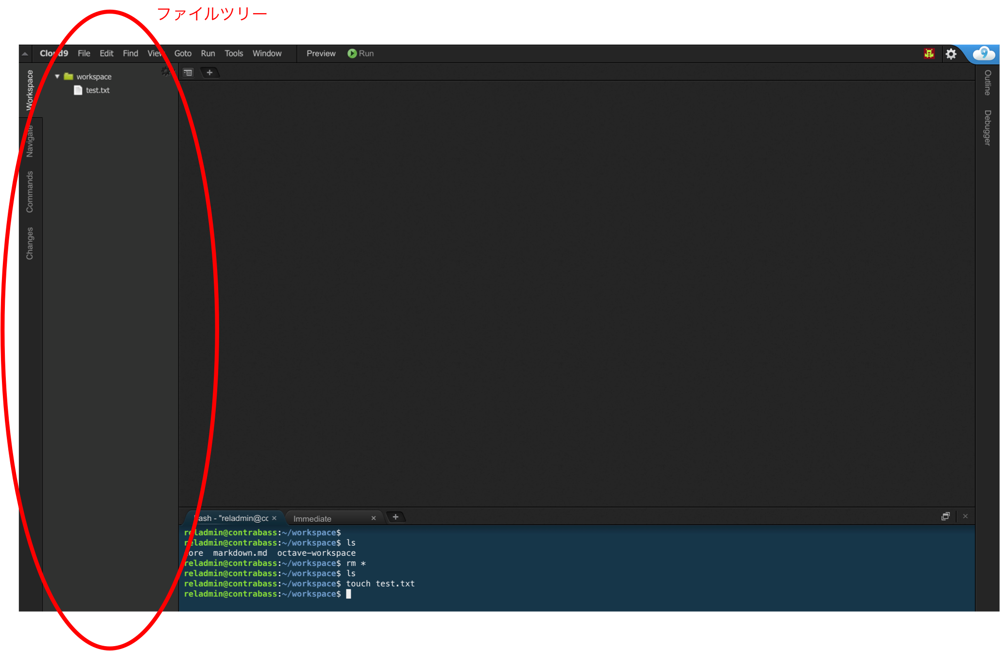
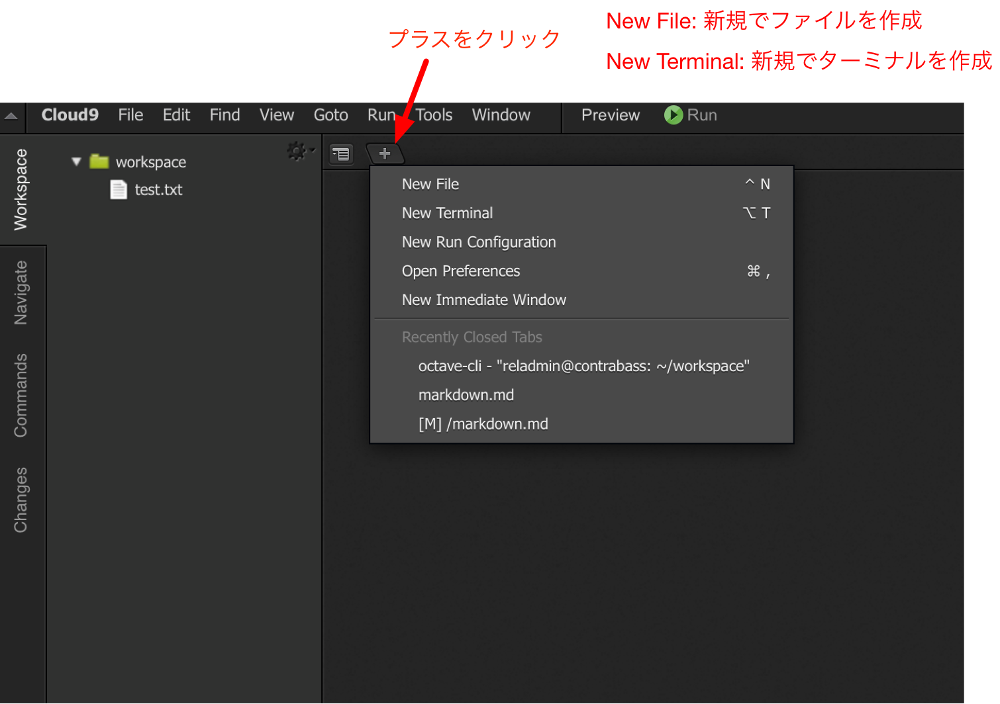
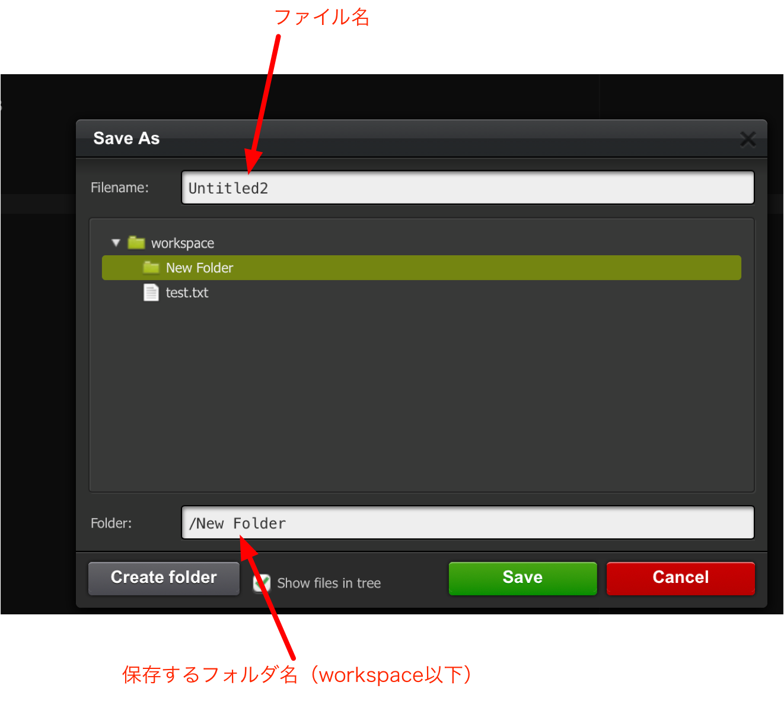
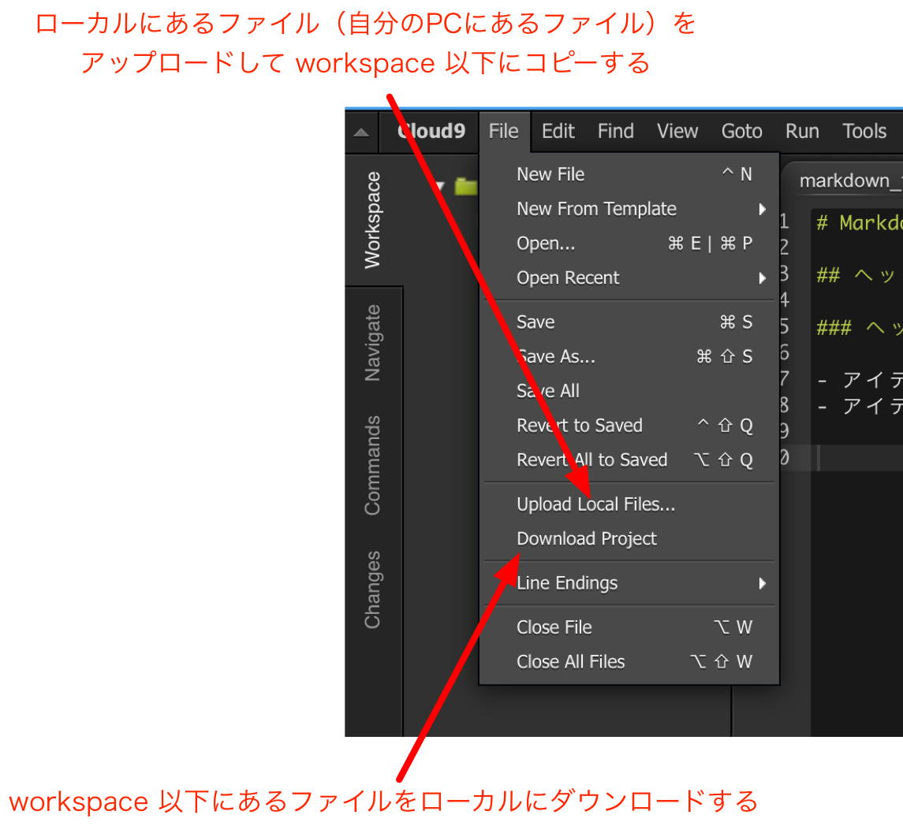

<style>
section {
    width: 960px;
    height: 720px;
    font-size: 20pt;
}
em {
    font-style: normal;
    color: purple;
}
strong {
    font-style: normal;
    color: red;
}
img[alt~="center"] {
  display: block;
  margin: 0 auto;
}
</style>

## Cloud9 とは

- クラウド IDE (統合開発環境)で，有料サービスとしては Amazon AWS が提供しています．
- Cloud9 のコアはオープンソースであり，ローカル環境で利用できます．
- 講義では Cloud9 を使ってプログラミング等を行います
（自分で環境構築できる人は Cloud9 を使わなくても良いです）

---

## 利用方法

- 情報工学専攻の端末（地下にある端末）を利用します．
- 下記のアドレスにアクセスします．
    ```
    http://huispc01.huis.hiroshima-u.ac.jp/b1234567/
    ```
    `b1234567` は自分の学生番号 `B1234567` の先頭 B を*小文字のb*に置き換えた文字列です．
- ユーザ名とパスワードを聞かれるので下記を入力します．
    - ユーザ名：自分の学生番号のBをbに置き換えた文字列（例：b1234567）
    - パスワード：メール or 紙で配付

---

## 利用方法（その２）

- 終日使えるように暫定的にサーバを構築しました
- 下記のアドレスにアクセスします．
    ```
    http://se2019.rel.hiroshima-u.ac.jp/b1234567/
    ```
- ユーザ名とパスワードはこれまでのものと同じです．
- 1ホストで170名分のプロセスを立ち上げているので，動作が重くなったりサーバがダウンする可能性もあります（負荷テストしていません）．
    - ダウンした場合は岡村 okamu@hiroshima-u.ac.jp までメールしてください．
    - 実験的に構築しているので，ダウンした場合の不具合には応じません．自己責任で利用してください．
    - 終日立ち上げていますが，学内からのアクセスに限定していますので自宅から利用する場合は VPN を使ってください．

---

## 注意点

- パスワードは変更できないので適切に管理してください
- 地下にある端末を利用しているので，講義の時間中しか利用できません．講義時間以外でも利用したい場合は Docker での利用方法を参照してください．

---

## Cloud9の利用

- Cloud9 は Web ブラウザから使います．ファイルの作成，保存については直感的にできると思います．
- 左にファイルのツリーが表示されています．



---

## ファイルの作成

- タブのところにある「プラス丸」をクリックするとメニューがでるので [New File] とすると新規ファイルが作れます．



---

## ファイルの保存

- file メニューから save を選ぶ，またはキーボードショートカットで Ctrl+s （Mac は Cmd+s）すると保存します．初回は保存するディレクトリを選ぶ画面が出ます．



---

## ファイルのアップロード

- file メニューの「Upload Local Files ...」を選ぶとローカルにあるファイルをサーバ上へアップロードできます．



---

## ファイルのダウンロード
- file メニューの「Download Project」を選ぶとサーバ上の workspace 以下のファイルをダウンロードできます．


---

## ターミナルの起動
- タブのところの「プラス丸」から [New Terminal] とすると，Cloud9 が起動しているサーバの「端末（ターミナル）」が使えます．
- SSHなどでログインしているのと同じ状態なので，cd, ls などのコマンドがすべて使えます．


