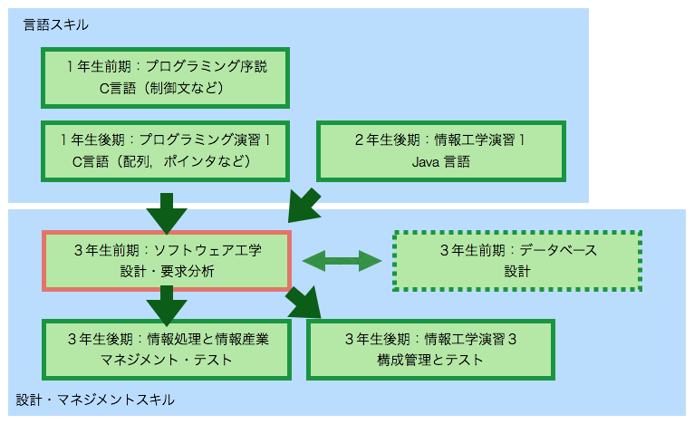
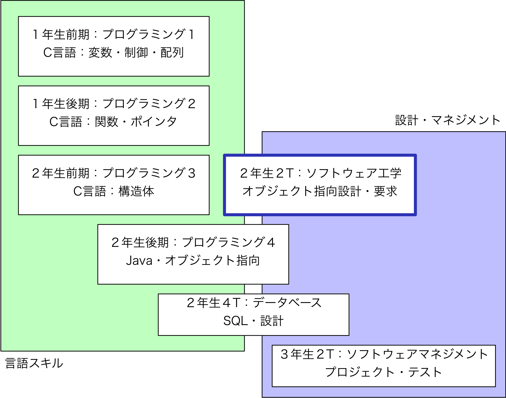

## ソフトウェア工学　ガイダンス

- この講義では**必携PCを利用**しますので準備してください．
- 講義は 13:00 から開始しますのでBb9の「教材」「第１週」「cloud9」を見て Cloud9を使ってみてください
- つまったら教員とTAへ気軽に聞いてください．

---

## この講義で学ぶこと

- 領域：SE (Software Engineering) 
多くの講義は CS (Computer Science) 領域
- 知識
	- 典型的なソフトウェア開発工程を理解する
	- 各工程でやること（作業項目）を理解する
		- 難しさ＆気をつけるべきこと
- 技術（スキル）
	- ソフトウェア設計の概要
	- UMLの記述
	- オブジェクト指向プログラミング
	- オブジェクト指向設計

---

---

---

---

# 対象受講生と講義資料

- 対象
	- 工学部第二類３年生（情報工学課程：必修）
	- 情報科学部２年生（選択必修）
	- 将来システム開発を目指す人（コンサル，PM）
- 講義資料
	- 教科書は指定しない
	- 参考書：Java, UML に関する書籍
	- 講義スライド（Bb9 に掲載）
	- 講義ノート（Bb9 に掲載）
	- 講義室ではノートPC，タブレットPCで閲覧することを推奨する

---

# 成績評価

- 期末試験
	- ソフトウェア開発に関する知識
	- オブジェクト指向設計に関する問題
	- Java，UML
- グループ課題
	- グループによる提出物
	- 個人による提出物

---
# 他の授業との関係（第二類）

---
# 他の授業との関係（情報科学部）

---

# 講義予定

- 6/14 Fri. ソフトウェア工学概論
- 6/21 Fri. Java/ソフトウェアテスト/TDD
- 6/28 Fri. オブジェクト指向プログラミング／アジャイル体験
- 7/5 Fri. ソフトウェア設計
- 7/12 Fri. ソフトウェア要求
- 7/19 Fri. オブジェクト指向設計
- 7/26 Fri. ソフトウェア品質・レビュー
- 8/2 Fri. ふりかえり・まとめ／期末テスト
