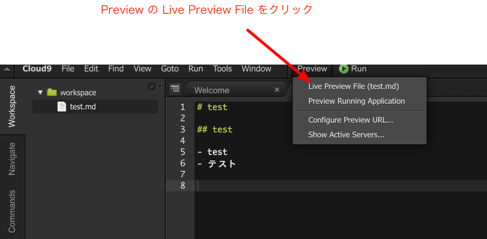

<style>
section {
    width: 960px;
    height: 720px;
    font-size: 20pt;
}
em {
    font-style: normal;
    color: purple;
}
strong {
    font-style: normal;
    color: red;
}
img[alt~="center"] {
  display: block;
  margin: 0 auto;
}
</style>

# Markdown

---

## マークアップ（Markup）言語

- 文書構造（章，節，段落，文字飾り）などを記述するための言語
- HTML (Hypertext Markup Language), Markdown, TeX, etc.
- 文書構造が規定されているのでコンピュータにより処理しやすい（視覚的に整形するなど）

---

## Markdown 記法

- 軽量なマークアップ言語
- テキスト形式で手軽に書いた文書からHTMLを生成
- HTML以外の形式（TeX, PowerPoint, Word, etc.）へ変換することも可能
- 利用例
    - プログラムの説明
    - 文書の下書き

---

## 段落と改行

- 段落は空行で一行あける．
- 改行は行末で半角スペースを2つ以上入力する．

---

## 見出し

- `#` で見出しとそのレベルを表す．

```
# 見出し１

## 見出し２

### 見出し３

#### 見出し４

##### 見出し５

###### 見出し６
```

---

## 箇条書き

ハイフン-，プラス+，アスタリスク*のいずれかを先頭に記述する．ネストはタブで表現する．

```
- リスト1
    - リスト1_1
        - リスト1_1_1
        - リスト1_1_2
    - リスト1_2
- リスト2
- リスト3
```

---

## 箇条書き（番号付き）

`1.` を先頭に記述する．ネストはタブで表現する．

```
1. リスト1
    1. リスト1_1
        1. リスト1_1_1
        2. リスト1_1_2
    2. リスト1_2
2. リスト2
3. リスト3
```

---

## その他

- 水平線：ハイフン，アスタリスク，アンダーバーを3つ以上並べる．
- インラインコード：`（バッククォート）で囲む
- ブロックコード：```（バッククォートを三つ）で囲む
- 外部リンク：`[表示文字列](URL)`
- 画像：`[代替文字列](URL)`

---

## Cloud9 での利用

- Markdown の編集
    - テキストファイルとして編集
    - 拡張子 .md として保存
- Live preview


