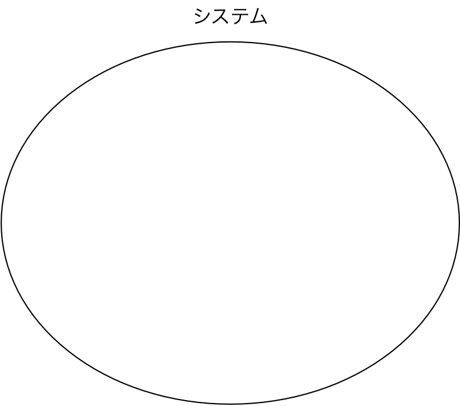
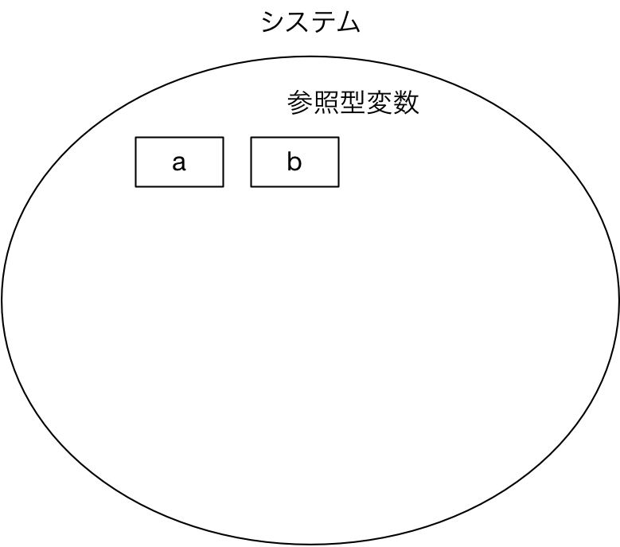
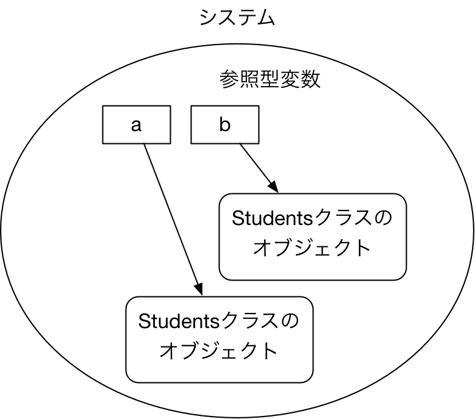

<style>
section {
    width: 960px;
    height: 720px;
    font-size: 20pt;
}
em {
    font-style: normal;
    color: purple;
}
strong {
    font-style: normal;
    color: red;
}
img[alt~="center"] {
  display: block;
  margin: 0 auto;
}
</style>

# 第2週：オブジェクト指向プログラミング

## 目次

### 構造化プログラミングとオブジェクト指向
### Java
### オブジェクト指向プログラミング（基礎）

## 課題

- note_week2.md を作成して Bb9 を通じて提出せよ．
- Cloud9 の Markdown プレビュー機能を活用
- Visual Studio Code (https://code.visualstudio.com) や ATOM (https://atom.io) をインストールし，Markdown プレビュー機能を活用してもよい

## 構造化プログラミングとオブジェクト指向

## 構造化定理

- すべての処理は順序処理，分岐処理，反復処理の三つの組み合わせで作ることができる

  

---

- どのような処理でもGOTO文（任意の場所から任意の場所へジャンプする命令文）を使う必要がない
- 処理の最初（入り口）と処理の終わり（出口）が一つで十分
- プログラム全体を一つの入り口と出口をもつブロック単位で設計できる

**構造化定理にもとづいた言語 :arrow_right: C言語**

## 構造化設計／言語

- C言語による設計のポイント
	- 関数をどのように設計するか
	- 機能をどのように分解して関数化するか
- 構造化設計：どの機能によってデータがどのように変更されるか
- 欠点：設計上でデータと処理が分離しているため再利用性が低い

## 再利用の例

- 以下のプログラムを線形リストをソートするプログラムに利用できるか？
- できる or できない：それはなぜか？

```c
/**
 * 長さ n の配列 x の要素を昇順にソートする
 * @param n 配列 x の要素数
 * @param x ソートする配列
 */
void sort(int n, int* x) {
  // ...
  // 何かしらの実装
  // ...
}
```

## オブジェクト指向設計／言語

- オブジェクト：処理とデータを一体化したもの
- 現実世界のモノ（オブジェクト）をモデル化
	- データ：情報
	- 処理：情報を変化させる操作
- オブジェクト同士の相互作用による処理
- ソフトウェア再利用性の向上

#### 例：テニスゲーム

- ボール：ボールが存在している位置情報と「動かす」という操作
- ラケットとボールの相互作用：打つ／打たれる，動く
- 再利用性：ボールオブジェクトを野球ゲームに流用

---

```java
class Container {
  int length; // 要素の長さ
  int getLength(); // 要素の長さを取得
  void swap(int i, int j); // i 番目と j 番目の要素を交換
  // ...
}
```

```java
/**
 * コンテナ型 x の要素を昇順にソートする
 * @param x ソートするコンテナ
 */
void sort(Container x) {
  // ...
  // 何かしらの実装
  // ...
}
```

## オブジェクト指向言語の基本的な考え方

### カプセル化（隠蔽）

- オブジェクト内部のデータや振る舞いを外部から隠蔽
- 外部との相互作用（インタラクション）だけに注目させる

### 継承（インヘリタンス）

- あるオブジェクトが別のオブジェクトの特性を引き継ぐ
- オブジェクトを階層的に整理

### 多態性（ポリモフィズム）

- 同じ相互作用は同じでも振る舞いが違う
- インタフェースを共通化させる

## 例でみるオブジェクト指向

### カプセル化の例

- 車の動作原理はしらないが運転はできる
- 内部の動作をユーザから隠蔽

### 継承（インヘリタンス）の例

- ハイブリッド車とガソリン車はともに「車」の特性を引き継ぐ
- 内部の動作原理は異なる

### 多態性（ポリモフィズム）の例

- ガソリン車でもハイブリッド車でも同じ操作で運転できる
- インタフェースを共通化されている

## どちらを使えばいいの？

- 構造化言語
	- コンパイル・実行速度 :arrow_right: 速い
	- メンテナンス :arrow_right: あまり良くない
- オブジェクト指向言語
	- コンパイル・実行速度 :arrow_right: 遅い
	- メンテナンス :arrow_right: 良い

- 組込システム :arrow_right: 構造化言語 **最近は徐々にオブジェクト化**
- エンタープライズシステム :arrow_right: オブジェクト指向言語

**オブジェクト指向は現在のプログラミングでは必須!!**

---

*Exercise: C言語, Java 以外で 4 つ以上のプログラミング言語を挙げて「オブジェクト指向」のスタイルでかけるかどうか調査せよ*

# Java

## 概要

- Sun Microsystems 社（現在は Oracle に買収）が開発
- オブジェクト指向言語
- プラットフォーム非依存
	- 中間言語にコンパイルされ，仮想マシン（JavaVM）上で動作
- 豊富なライブラリ
	- オブジェクト指向プログラミングによる部品化の恩恵

## Java ソースファイルの作成

- すべての手続き（メソッド）は何らかのクラスに属する
- main メソッドは外部から実行できる特殊なメソッド
	- `public static void main(String[] args)`

  *ファイル名： `Test.java`*
  ```java
  class Test {
      public static void main(String[] args) {
          System.out.println("Hello World");
      }
  }
  ```

## コンパイル

- javac コマンドによるコンパイルにより中間ファイルを生成する
- java ソースに記述してあるクラス名に対応した .class ファイルが生成される

  ```sh
  $ javac Test.java
  ```

- 上記のコマンドにより中間ファイル `Test.class` が生成される．

## 実行

- java コマンドによる実行
- `main` メソッドを含む**クラス名**を指定して実行（クラスファイル名ではないので .class はいらない）

  ```sh
  $ java Test
  Hello World
  ```

## C言語とJavaの相違点

### 型について

基本データ型（primitive）とよばれる以下の型は C 言語とほぼ同じ

| | C言語 | Java |
|:--| :-- | :-- |
|文字 | char | byte, char (unicode) |
|論理 | --- | boolean |
|整数 | int, short, long | int, short, long |
|浮動小数点| float, double | float, double |
|文字列| charの配列 | String クラス（primitiveではない） |

---

### 演算子について

C言語にあってJavaにないもの

- カンマ演算子
- sizeof 演算子
- アドレス演算子（&）
- ポインタ演算子（->）

Javaだけにあるもの

- new 演算子
- instanceof 演算子

---

### 文について

- 代入文, if文, for文, while文, do while 文, switch 文の書き方は同じ
- Java の新しいバージョンでは拡張 for 文などが使える

---

### 配列について

- new 演算子を使った配列の確保

  c 言語での
  ```c
  int a[3];
  ```
  を，Javaでは

  ```java
  int[] a = new int[3]; // int[] は型を表す
  ```
  とする．

---

- new は C 言語での malloc に相当するため，以下のようにしてプログラム途中で動的に配列を定義（動的なメモリ確保）することができる

  ```java
  int[] a;
  ...
  a = new int[3];
  ```

---

### その他の相違点

- Java では**ポインタ**を明示しない．参照型変数を利用する．
- Java ではグローバル変数宣言ができない
- Java には構造体がない（クラスを利用する）

---

*Exercise: Java で FizzBuzz 問題をプログラミング*

```markdown
TODO
- FizzBuzz の作成
  - 数値（1から100）を入力して文字列 "1", ..., "100" を出力する
  - 3の倍数の時に文字列 Fizz を出力する
  - 5の倍数の時に文字列 Buzz を出力する
  - 3かつ5の倍数のときに文字列 FizzBuzz を出力する
```

ひな形

```java
class FizzBuzz {
  public static void main(String[] args) {
    for (int x=1; x<=100; x++) {
      // 表示処理など
    }
  }
}
```

---

*Exercise: Java で FizzBuzz 問題をプログラミング*
メソッド（関数）を使ってみる

```java
class FizzBuzz {
  /**
    * 数値xを入力として FizzBuzz 文字列を返す．
    * 3の倍数ならFizz, 5の倍数ならBuzz, 3かつ5の倍数なら FizzBuzz, 
    * それ以外は数値を文字列にしたものを返す．
    * TODO: 数値から文字列への変換を調べる
    */
  static String int getFizzBuzzString(int x) {
    // 処理を記述
  }

  // main は改変しないでください
  public static void main(String[] args) {
    for (int x=1; x<=100; x++) {
      System.out.println(getFizzBuzzString(x));
    }
  }
}
```

# オブジェクト指向プログラミング（基礎）

## オブジェクト指向プログラミングの基礎用語

- オブジェクト
- クラス
- 属性（フィールド変数）
- 操作（メソッド）
- インスタンス化
- 参照型変数（オブジェクト変数）
- コンストラクタ（初期化操作）

## オブジェクトとクラス

- プログラム
:arrow_right: オブジェクトの相互作用（オブジェクト間のやりとり）
- クラス
  - オブジェクトの定義
  - クラスとして定義された内容に従ってオブジェクトが作成される
  - クラスとオブジェクトを区別することが重要
  （クラスを**インスタンス化**したものがオブジェクト）

## 属性（フィールド変数）

- オブジェクト自身が知っていること
- クラスの定義で記述する

## メソッドの定義

- そのクラスに対する「操作」
- C言語の関数のようなもの
- クラスの定義で記述する

*`main` メソッドはプログラム実行時に最初に実行される特殊なメソッド*

## 例

#### 「もみじ」のようなシステムを考える．

- オブジェクト
  - 学生オブジェクト：個々の学生 :arrow_right: 田中さん，山田さん，etc.
  - 授業オブジェクト：個々の授業 :arrow_right: ソフトウェア工学，etc.
- クラス
  - 学生クラス：学生オブケジェクトの定義（属性と操作の定義）
  - 授業クラス：授業オブジェクトの定義（属性と操作の定義）
- 属性
  - 学生クラス：氏名，学生番号，etc.
  - 授業クラス：授業名，担当教員，etc.

## Javaでの表記

- Javaにおけるクラスの定義
	- クラス名は大文字で始める（推奨）
	- クラス内のデータ構造 :arrow_right: **フィールド変数**

```java
class Students {
  // 属性，フィールド変数は class 内に
  // 変数として定義する
  String name; // 氏名
  String id; // 学生番号
}
```

## インスタンス化

*クラスStudentsを定義しただけでは「田中さん」も「山田さん」もできていない！*

- インスタンス化：クラスからオブジェクトを生成する手続き
- オブジェクト：クラスから生成された実体

**学生クラスから学生オブジェクト「田中さん」，「山田さん」を作る!**

## 参照型変数（オブジェクト変数）

*オブジェクトを作ってもアクセス（参照）できないと何もできない！*

- オブジェクトを参照するための変数
- C言語におけるポインタと似ている

## Javaでのインスタンス化と参照型変数

- new 演算子を使う
- `クラス名 変数名` として参照型変数を定義する

## Javaプログラミング

- 以下をファイル名 `Test.java` として作成
```java
class Students {
  String name; // 氏名
  String id; // 学生番号
}

class Test { // 実行するためのクラス
  public static void main(String[] args) {
    Students a, b; // Studentsクラスを参照する変数 a, b を定義
    a = new Students(); // 田中オブジェクトを作成
    b = new Students(); // 山田オブジェクトを作成
  }
}
```

- 実行

```sh
% javac Test.java
% java Test
```

## 実行時のイメージ：実行前



## 実行時のイメージ：参照変数定義後



## 実行時のイメージ：`new`によるオブジェクト生成後



## オブジェクトへの操作（相互作用）を考える

- オブジェクト
  - 学生オブジェクト：個々の学生 :arrow_right: 田中さん，山田さん，etc.
  - 授業オブジェクト：個々の授業 :arrow_right: ソフトウェア工学，etc.
- クラス
  - 学生クラス：学生オブケジェクトの定義（属性と操作の定義）
  - 授業クラス：授業オブジェクトの定義（属性と操作の定義）
- 属性
  - 学生クラス：氏名，学生番号，etc.
  - 授業クラス：授業名，担当教員，etc.
- **操作**
  - **学生クラス：名前を聞く，etc.**

## Javaでの表記

- Javaにおけるクラスの定義
	- クラス名は大文字で始める（推奨）
	- クラス内のデータ構造 :arrow_right: フィールド変数
	- **クラスに対する操作 :arrow_right: メソッド**

```java
class Students {
  String name; // 氏名
  String id; // 学生番号

  // 操作はクラス内で「関数」のように定義する

  String getName() { // 名前を聞く
    return name; // 「自分の」属性値を返す
  }
}
```

## メソッドの利用

- クラス外：**どのオブジェクトを操作するか**を指定する必要がある
```
オブジェクト変数.（ドット）メソッド名（引数）
```
- クラス内
  - this キーワードを利用（`this`はクラス内で自分を参照する特別な参照型変数）
  ```
  this.メソッド名（引数）
  ```
  - オブジェクトが省略された場合は自分自身がデフォルト（見かけ上はC言語の関数呼び出しと同様にみえる）

## Javaプログラミング
- 以下をファイル名 `Test.java` として作成・実行
```java
class Students {
  String name;
  String id;

  String getName() {
    return name;
  }
}

class Test {
  public static void main(String[] args) {
    Students a, b;
    a = new Students(); // 田中オブジェクトを作成
    b = new Students(); // 山田オブジェクトを作成
    System.out.println(a.getName()); // 田中オブジェクトのメソッドを実行して表示
    System.out.println(b.getName()); // 山田オブジェクトのメソッドを実行して表示
  }
}
```

---

*田中も山田も `null` を表示*
:arrow_right: *一つの解決方法：属性をセットするメソッドを作る*

```java
class Students {
  String name;
  String id;

  String getName() {
    return name;
  }

  void setName(String nm) {
    name = nm; // 名前をセットする操作を追加
  }
}

class Test {
  public static void main(String[] args) {
    Students a, b;
    a = new Students(); // 田中オブジェクトを作成
    b = new Students(); // 山田オブジェクトを作成
    a.setName("田中"); // 田中オブジェクトのメソッドを実行
    System.out.println(a.getName());
    System.out.println(b.getName());
  }
}
```

## コンストラクタ

- 初期化のための特殊なメソッド
- インスタンス化の時に一度だけ呼ばれる
- フィールド変数の初期化などを行う

*最初からオブジェクトが知っている情報をセット*

## Javaでの表記

- Java の場合は**クラス名と同じ名前のメソッドとしてコンストラクタを定義**
- new の際に引数で情報を渡す

```java
class Students {
  String name;
  String id;

  Students(String nm, String i) { // 引数二つ
    name = nm;
    id = i;
  }

  String getName() {
    return name;
  }
}
```

---

前ページからの続き

```java
class Test {
  public static void main(String[] args) {
    Students a, b;
    a = new Students("田中", "b1234567"); // 田中オブジェクトを作成
    b = new Students("山田", "b1234568"); // 山田オブジェクトを作成
    System.out.println(a.getName());
    System.out.println(b.getName());
  }
}
```

## 参照型変数（その２）

- 参照型変数の代入は参照先を変更する
- 参照型変数の定義だけでは new しないことに注意！

---

```java
class Students {
  String name;
  String id;

  Students(String nm, String i) {
    name = nm;
    id = i;
  }

  String getName() {
    return name;
  }
}

class Test {
  public static void main(String[] args) {
    Students a = new Students("田中", "b1234567");
    Students b = new Students("山田", "b1234568");
    Students c = a;
    a = b;
    b = c;
    System.out.println(a.getName());
    System.out.println(b.getName());
    System.out.println(c.getName());
  }
}
```

*Exercise: 上記のプログラムの実行結果を予想せよ*

## static 修飾子

*そういえばTestクラスはnewしてるの？*
*mainメソッドは誰が呼び出してるの？*

- フィールドおよびメソッドに適用可能
- コンパイル時に実体を作成するため new しなくてもよい

---

```java
class StaticTest {
  int x = 2;

  public static int getOne() {
    // 以下はNG: static 関数で non-static 変数を参照してはいけない
    return x;
  }

  public int getTwo() {
    return x;
  }
}

class Test {
  public static void main(String[] args) {
    StaticTest.getOne(); // OK
    // 以下はNG: non-static 変数は new してから呼び出す
    StaticTest.getTwo();
    StaticTest s = new StaticTest();
    s.getOne(); // OK
    s.getTwo(); // OK
  }
}
```

## Exercise

- 学生クラス（class Students）で「学生番号を聞く」メソッド（getID）を作成せよ．
- 属性として，講義名（String），担当教員名（String）をもつ，授業クラス（class Lectures）を作成して，「講義名を聞く」（getLectureName），「担当教員名を聞く」（getTeacherName）メソッドを作成せよ．

---

- 学生クラス，授業クラスを完成後，以下のテストプログラムとともに実行し，その結果を示せ．

```java
class Students {
  // 実装
}

class Lectures {
  // 実装
}

class Test {
  public static void main(String[] args) {
    Students[] students = new Students[2];
    Lectures[] lectures = new Lectures[6];

    students[0] = new Students("田中", "b1234567");
    students[1] = new Students("山田", "b1234568");

    lectures[0] = new Lectures("ソフトウェア工学", "岡村");
    lectures[1] = new Lectures("確率論基礎", "土肥");
    lectures[2] = new Lectures("プログラミング１", "亀井");
    lectures[3] = new Lectures("線形代数学１", "栗田");
    lectures[4] = new Lectures("微分積分学１", "向谷");
    lectures[5] = new Lectures("離散数学１", "今井");
    for (int i=0; i<students.length; i++) {
      System.out.println("私の名前は" + students[i].getName() + "です．学生番号は" + students[i].getID() + "です");
    }
    for (int i=0; i<lectures.length; i++) {
      System.out.println(lectures[i].getLectureName() + "の担当は" + lectures[i].getTeachearName() + "です");
    }
  }
}
```

## 課題（再掲）

- note_week2.md を作成して Bb9 を通じて提出せよ．
- Cloud9 の Markdown プレビュー機能を活用
- Visual Studio Code (https://code.visualstudio.com) や ATOM (https://atom.io) をインストールし，Markdown プレビュー機能を活用してもよい
